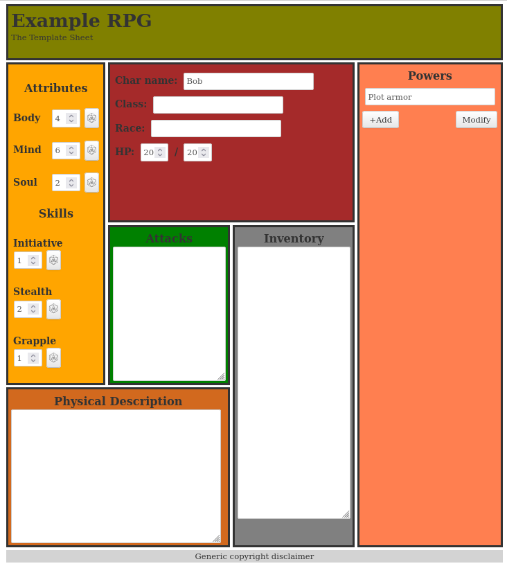
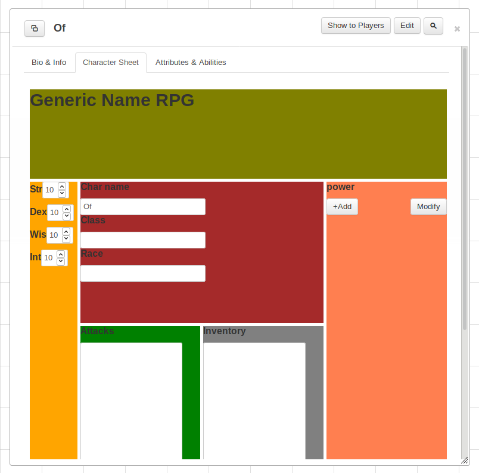

# Roll20 Character Sheet Template

A simple Character Sheet Template for [Roll20](https://roll20.net/).

See [Building Character Sheets](https://wiki.roll20.net/Building_Character_Sheets) for Roll20 sheet documentation.

* [Using Custom Sheets](https://wiki.roll20.net/Using_Custom_Character_Sheets)
* [Sheet Author Tips](https://wiki.roll20.net/Sheet_Author_Tips)

- [Roll20 Character Sheet Template](#roll20-character-sheet-template)
- [Templates](#templates)
  - [New](#new)
  - [Old](#old)
- [Helpful Tools](#helpful-tools)

# Templates

## New
The [simple-template](./simple-template)-folder containts a simple sheet template with a basic layout, containing examples of the most common elements sheets usually have.

The primary layout is made using [CSS Grid](https://wiki.roll20.net/Designing_Character_Sheet_Layout#CSS_Grid), with [grid-template-areas](https://developer.mozilla.org/en-US/docs/Web/CSS/CSS_Grid_Layout/Grid_Template_Areas).

* Benefit with using grid-template-areas is that naming sheet sections and then easily display in a human-readable grid in the CSS file.
* The drawback is that you can't have sections that overlap with each-other, using grid-template-areas.

See [Character Sheet Enhancement(CSE)](https://wiki.roll20.net/CSE) for new sheet features in 2021.

## Old
**Not recommended**

The [simple-template-legacy](./simple-template-legacy)-folder contains the barebones sheet example I made back in 2019, which works for [Legacy Character Sheets(LCS)](https://wiki.roll20.net/Legacy_Sheet).

This is the format sheet code follow, if they where designed before March 2020, and behaves slightly differently than sheets updated to follow the [Character Sheet Enhancement(CSE)](https://wiki.roll20.net/CSE) format.

# Helpful Tools

 [Virtual Studio Code](https://code.visualstudio.com/) Extensions:
 
 * [Roll20 Sheet Dev](https://marketplace.visualstudio.com/items?itemName=anduh.roll20sheetdev) - Various Improvements for VS Code to optimize for Roll20 Character Sheet editing & development. 
 * [Roll20 Macros](https://marketplace.visualstudio.com/items?itemName=anduh.rmacro)  - provides syntax highlight for Roll20's [macro & dice syntax](https://wiki.roll20.net/Macro_Guide).